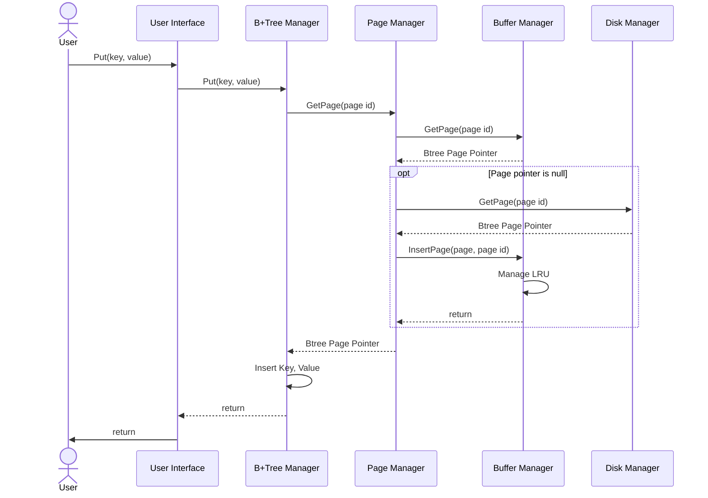
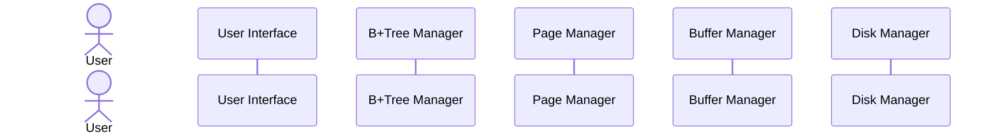

# Architecutral Sequence Diagrams

## Put

```mermaid
sequenceDiagram
  actor user as User
  participant ui as User Interface
  participant tree as B+Tree Manager
  participant page as Page Manager
  participant buffer as Buffer Manager
  participant disk as Disk Manager

  user ->> ui: Put(key, value)
  ui ->> tree: Put(key, value)
  tree ->> page: GetPage(page id)
  page ->> buffer: GetPage(page id)
  buffer -->> page: Btree Page Pointer
  opt Page pointer is null
    page ->> disk: GetPage(page id)
    disk -->> page: Btree Page Pointer
    page ->> buffer: InsertPage(page, page id)
    buffer ->> buffer: Manage LRU
    buffer -->> page: return
  end
  page -->> tree: Btree Page Pointer
  tree ->> tree: Insert Key, Value
  tree -->> ui: return
  ui ->> user: return
```

### Data Placement

### IO

## Get

```mermaid
sequenceDiagram
  actor user as User
  participant ui as User Interface
  participant tree as B+Tree Manager
  participant page as Page Manager
  participant buffer as Buffer Manager
  participant disk as Disk Manager
```

### IO

## Buffer Manager

## Recovery
